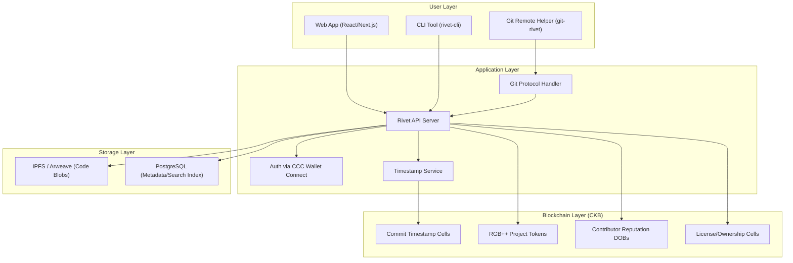

# 🛡️ Rivet — Provable Repository of Open & Onchain Files

> *Your code. Your keys. Your rivet. Forever.*

A decentralized, censorship-resistant code hosting platform where developers **truly own** their code — backed by CKB blockchain timestamps, RGB++ asset bindings, and CCC wallet connectivity.

---

## The Problem

| Pain Point | GitHub Today | Rivet Solution |
|---|---|---|
| **Account suspension** | GitHub can suspend accounts, delete repos, and lock you out of your own code overnight — no appeal, no warning | Identity is your **CKB wallet**. No one can suspend a private key |
| **Centralized control** | Microsoft owns your code's availability. A single policy change affects 100M+ developers | Code stored on **decentralized infrastructure** (IPFS/Arweave + CKB anchoring) |
| **No rivet of authorship** | Git commits can be forged. Timestamps are mutable. No cryptographic rivet of "I wrote this first" | Every commit/release gets an **on-chain CKB timestamp** — immutable, provable, legally defensible |
| **Vendor lock-in** | GitHub Actions, Packages, Copilot — all tied to the platform | Open protocols. Bring your own CI. Interoperable by design |
| **No developer ownership** | Your open source contributions don't translate to tangible ownership | **RGB++ tokens** can represent project ownership, contributor reputation, and governance rights |

---

## Competitive Landscape & Where Rivet Wins

| Platform | Approach | Rivet's Edge |
|---|---|---|
| **Radicle** | P2P Git (no blockchain) | No on-chain rivet, no tokenized governance, no wallet UX |
| **Gitopia** | Cosmos-based blockchain | Separate chain with tiny ecosystem. CKB has Bitcoin-level security via merged mining + RGB++ Bitcoin bridge |
| **Forgejo/Gitea** | Self-hosted | Still centralized per instance. No cryptographic timestamps. No ownership layer |
| **Rivet** | **CKB + RGB++ + CCC** | Bitcoin-anchored timestamps, cross-chain wallet access, tokenized ownership, rich web UX |

---

## Core Architecture



---

## CKB Integration Strategy

### 1. 🔐 Identity & Auth (via CCC)

Instead of username/password, developers connect with **any wallet** via CCC:

- **MetaMask** users → CKB address derived via CCC account abstraction
- **UniSat** (Bitcoin) users → Same, bridged seamlessly
- **JoyID** → Passkey-based, zero-extension onboarding
- **OKX Wallet** → Cross-chain native

> **Result**: No accounts to suspend. Your identity IS your cryptographic key. Works from any ecosystem.

### 2. ⏱️ Commit Timestamps (CKB Cells)

Every significant event gets anchored on-chain:

```
┌─────────────────────────────────────────────────┐
│  Timestamp Cell                                  │
│                                                  │
│  data: {                                         │
│    repo_id:    "rivet://alice/my-project"        │
│    commit:     "abc123def..."                    │
│    tree_hash:  "sha256:..."                      │
│    timestamp:  1726678590                        │
│    signature:  "0x..."                           │
│  }                                               │
│                                                  │
│  lock: <author's CKB lock script>               │
│  type: <TimestampTypeScript>                     │
│  capacity: ~200 CKB                              │
└─────────────────────────────────────────────────┘
```

**What gets timestamped:**
- Commits (batched — e.g., every push or daily merkle root)
- Releases / Tags
- License declarations
- Transfer of ownership

**Why this matters:**
- **IP disputes**: "I committed this code on Sept 18, 2026 at 16:54 UTC" — provable, on-chain
- **Audit trails**: Open source supply chain security
- **Legal evidence**: Blockchain timestamps are increasingly accepted in courts

### 3. 🎨 RGB++ Project Tokens

Each repository can optionally mint **RGB++ tokens** representing:

| Token Type | Purpose | Example |
|---|---|---|
| **Project Ownership Token** | Governs who controls the repo | 51% holder can merge PRs, change settings |
| **Contributor Badges (DOBs)** | On-chain rivet of contribution | "Top Contributor to rivet-cli — 147 commits" (Spore DOB) |
| **Governance Tokens** | DAO-style project decisions | Vote on roadmap, accept/reject RFCs |
| **Bounty Tokens** | Incentivize issue resolution | "Fix this bug → earn 100 Rivet tokens" |

**RGB++ advantage**: These tokens are **isomorphically bound to Bitcoin UTXOs**, giving them Bitcoin-level security while being programmable on CKB.

### 4. 📦 Code Storage Strategy

Storing full repos on-chain is expensive and unnecessary. Instead:

| Layer | What's Stored | Where |
|---|---|---|
| **Hot storage** | Full Git repos, working trees | IPFS pinning nodes / Arweave (permanent) |
| **Metadata index** | Repo names, descriptions, search index, stars | PostgreSQL + optional CKB cells |
| **Rivet layer** | Commit hashes, merkle roots, timestamps, signatures | **CKB Cells** (on-chain, permanent, ~200-500 CKB per anchor) |
| **Ownership layer** | Project tokens, contributor DOBs, licenses | **RGB++ on CKB** (on-chain) |

> **Key insight**: You don't need to store code on-chain. You store the **rivet** on-chain — the hash, the timestamp, the signature. The code lives on IPFS/Arweave where it's content-addressable and verifiable against the on-chain rivet.

---

## Feature Roadmap

### Phase 1: MVP — "Rivet of Code" 🏗️
- [ ] Web UI for browsing repositories (read-only initially)
- [ ] CCC wallet login (MetaMask, JoyID, UniSat)
- [ ] `git push` to IPFS via custom Git remote helper
- [ ] On-chain commit timestamping (CKB)
- [ ] Basic repo management (create, fork, star)
- [ ] Public profile pages (linked to CKB address)

### Phase 2: Collaboration — "Social Coding" 🤝
- [ ] Pull requests & code review (on-platform)
- [ ] Issues & discussions
- [ ] Markdown rendering, syntax highlighting
- [ ] Notification system
- [ ] Organization/team management
- [ ] Search across all public repos

### Phase 3: Ownership — "Tokenized Open Source" 🪙
- [ ] RGB++ project token minting
- [ ] Contributor DOBs (Spore protocol)
- [ ] On-chain bounty system
- [ ] DAO governance for project decisions
- [ ] License management on-chain

### Phase 4: Ecosystem — "Developer Platform" 🌐
- [ ] CI/CD integration hooks (bring your own runner)
- [ ] Package registry (npm, cargo, pip — IPFS-backed)
- [ ] API for third-party integrations
- [ ] Mobile app
- [ ] Decentralized code search (full-text across all repos)
- [ ] Forkable "Rivet instances" (like Gitea but with shared identity layer)

---

## Monetization Ideas

| Model | Description |
|---|---|
| **Freemium storage** | Free public repos. Paid private repos (more IPFS pinning, larger limits) |
| **Rivet token** | Utility token for premium features, staking for priority indexing |
| **Enterprise** | Self-hosted Rivet instances with support |
| **Marketplace** | Commission on bounty payouts |
| **Grants** | Nervos Foundation / CKB ecosystem grants for development |

---

## Tech Stack Recommendation

| Component | Technology | Why |
|---|---|---|
| **Frontend** | Next.js + React | SSR for SEO, rich UI, fast iteration |
| **Backend API** | Node.js (Express/Fastify) or Rust (Axum) | Node for speed-to-market; Rust for performance later |
| **Database** | PostgreSQL | Battle-tested, great for search/indexing |
| **Git backend** | `git-http-backend` + custom hooks | Standard Git protocol compatibility |
| **Blockchain SDK** | `@ckb-ccc/core` + `@ckb-ccc/rgbpp` | Official CKB SDK with RGB++ support |
| **Storage** | IPFS (Helia) + Arweave (permanent backup) | Content-addressable, redundant |
| **Auth** | CCC wallet connect | Multi-wallet, multi-chain |
| **Search** | MeiliSearch or Typesense | Fast full-text search for code |
| **Containerization** | Docker + Docker Compose | Easy self-hosting story |

---

## What Makes Rivet Different — The Elevator Pitch

> **"GitHub stores your code on Microsoft's servers. Rivet stores your code on IPFS and anchors the rivet on Bitcoin (via CKB/RGB++). Your identity is your wallet — no one can suspend it. Your contributions are on-chain DOBs — no one can erase them. Your project governance is tokenized — no one can hijack it."**

---

## Open Questions for You

1. **Name**: Is "Rivet" the name you want, or do you have something else in mind?

2. **Scope**: Do you want to start with the full platform, or would you prefer to build a specific piece first (e.g., just the timestamp service + CLI tool)?

3. **Storage preference**: IPFS (cheaper, requires pinning), Arweave (permanent, pay once), or both?

4. **Token economics**: Do you want a platform-wide utility token (like "Rivet token"), or keep it purely per-project tokens?

5. **Self-hostable**: Should anyone be able to run their own Rivet instance (like Gitea), or is this a single hosted service?

6. **Target audience**: All developers, or specifically Web3/crypto developers first?

7. **What should we build first?** I can start coding any of these right now:
   - A) The **web UI prototype** (landing page + repo browser)
   - B) The **CKB timestamp service** (anchor commits on-chain)
   - C) The **`rivet-cli`** tool (push code to IPFS + timestamp on CKB)
   - D) The **CCC auth flow** (wallet-based login)
