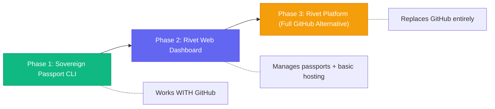
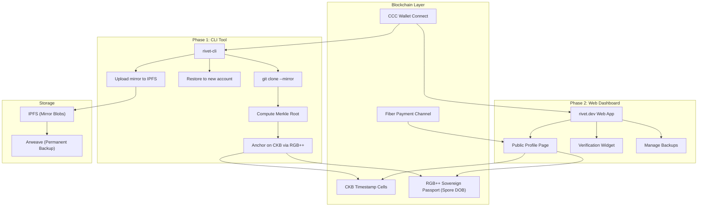

# 🔀 Unified Strategy: Backup Tool → Full Platform

## Side-by-Side Comparison

| Dimension | **Sovereign Passport** (Other Agent) | **Rivet Platform** (My Concept) |
|---|---|---|
| **What it is** | A CLI tool that backs up, anchors, and restores GitHub histories | A full GitHub-replacement platform |
| **Target user** | Any developer on GitHub (100M+ potential users) | Developers who want to leave GitHub entirely |
| **Complexity to build** | 🟢 Weeks to MVP | 🔴 Months to MVP |
| **CKB usage** | Merkle root of commit history → 1 Cell per backup | Commit timestamps, project tokens, DOBs, governance |
| **Adoption barrier** | 🟢 Low — works WITH GitHub, not against it | 🔴 High — requires developers to migrate |
| **Revenue potential** | Subscriptions, one-time backups | Freemium, tokens, enterprise |
| **Immediate pain solved** | ✅ "I got suspended, I need my code back" | ❌ "Build a whole new platform first" |
| **On-chain asset** | "Sovereign Passport" (RGB++ DOB) | Project tokens, contributor badges |
| **Fiber integration** | Payments/sponsorships to verified devs | Not in initial scope |

---

## The Key Insight: They're Not Competing — They're Phases



### Why this order is smart:

1. **Phase 1 (Sovereign Passport CLI)** — Build the backup tool first
   - Solves YOUR immediate problem (suspended account)
   - Solves a problem EVERY developer can relate to
   - Low barrier: `npm install -g rivet-cli` and you're done
   - Creates on-chain CKB Cells and RGB++ assets → builds the **data foundation**
   - Gets thousands of developers holding CKB assets without asking them to "join a new platform"

2. **Phase 2 (Rivet Dashboard)** — Web UI to manage your passport
   - "View your backed-up repos, verify your history, browse your Sovereign Passport"
   - Starts looking like a code hosting platform
   - Developers already have CKB wallets from Phase 1

3. **Phase 3 (Rivet Platform)** — The full GitHub alternative
   - By now you have users, on-chain data, and a reputation
   - Add collaboration features: PRs, issues, code review
   - This is the hardest part — but by Phase 3, you have momentum

---

## What I'd Take From Each Idea

### ✅ From the Sovereign Passport concept:

| Element | Why It's Great |
|---|---|
| **`git clone --mirror`** | Captures EVERYTHING — branches, tags, reflogs. This is the correct approach |
| **Merkle root on CKB** | Elegant — one Cell proves the entire history. Cost-efficient (~200 CKB) |
| **`git-filter-repo` for restore** | Smart — remaps emails so GitHub attributes commits to the new account |
| **"Sovereign Passport" branding** | Powerful narrative. Developers understand "passport" immediately |
| **Works WITH GitHub** | Critical for adoption. Don't ask people to leave — give them insurance |
| **Fiber for payments** | Forward-thinking. Verified devs can receive sponsorships trustlessly |

### ✅ From my Rivet concept:

| Element | Why It's Great |
|---|---|
| **CCC multi-wallet auth** | Don't force a specific wallet. MetaMask, JoyID, UniSat — all work |
| **IPFS/Arweave storage** | The mirror backup should be stored decentrally, not just locally |
| **Spore DOBs for contributor badges** | The Sovereign Passport should BE a Spore DOB — rich, visual, on-chain |
| **Per-commit timestamps (optional)** | Beyond the Merkle root, high-value repos might want individual commit anchoring |
| **Web UI for browsing** | The passport needs a web viewer — "rivet.dev/alice" shows your verified history |
| **Project governance tokens** | Phase 3 feature, but the architecture should support it from day 1 |

---

## Unified Architecture: The Best of Both



---

## The Sovereign Passport — What It Actually Looks Like On-Chain

```
┌──────────────────────────────────────────────────────┐
│  Sovereign Passport (RGB++ Spore DOB)                │
│                                                      │
│  Content: {                                          │
│    type: "sovereign-passport/v1"                     │
│    owner: "ckb1q...abc"                              │
│    github_username_hash: "sha256(jedi)"              │
│    created_at: 1726678590                            │
│    repos: [                                          │
│      {                                               │
│        name: "my-project",                           │
│        merkle_root: "0xabc123...",                   │
│        commit_count: 847,                            │
│        first_commit: "2019-03-15T10:30:00Z",        │
│        last_commit: "2026-09-18T16:00:00Z",         │
│        ipfs_mirror: "bafybeig..."                   │
│      },                                             │
│      ...                                            │
│    ],                                                │
│    total_commits: 3241,                              │
│    total_repos: 47,                                  │
│    signature: "0x..."                                │
│  }                                                   │
│                                                      │
│  lock: <owner's CKB lock>                            │
│  type: <SporeTypeScript>                             │
│  capacity: ~500 CKB                                  │
└──────────────────────────────────────────────────────┘
```

> **Anyone** can look up this Cell and verify: *"This developer wrote 3,241 commits across 47 repos. Here are the Merkle roots. Here are the IPFS links to the full mirrors. This is cryptographically provable."*

---

## What I'd Build Differently From the Other Agent's Proposal

| Their Approach | My Improvement | Why |
|---|---|---|
| Local mirror only | Mirror → **IPFS + Arweave** | Local backups can be lost. Decentralized storage = true redundancy |
| Single Merkle root per backup | **Merkle tree with per-repo roots** | Allows verifying individual repos without downloading everything |
| Generic RGB++ asset | **Spore DOB (Digital Object)** | Rich, visual, composable. Can render as a profile card |
| `git-filter-repo` email mapping | Same + **CKB-based identity linking** | On-chain rivet that old identity → new identity, not just email tricks |
| Fiber for payments | Fiber + **bounty system** | Not just sponsorships — "I'll pay 100 CKB to anyone who fixes this bug" |
| CLI only | **CLI + Web dashboard** from Phase 2 | Most developers want a visual interface to manage their passport |

---

## Recommended Build Order

### 🏗️ Sprint 1 (Weeks 1-2): Core CLI + CKB Anchoring
```
rivet backup    → git clone --mirror + compute Merkle root
rivet anchor    → Write Merkle root to CKB Cell via CCC
rivet verify    → Check a backup against its on-chain anchor
```

### 🏗️ Sprint 2 (Weeks 3-4): IPFS Storage + Restore
```
rivet upload    → Push mirror to IPFS, store CID on-chain
rivet restore   → Pull from IPFS, remap emails, push to new account
rivet status    → Show all backed-up repos and their on-chain status
```

### 🏗️ Sprint 3 (Weeks 5-6): Sovereign Passport (RGB++ DOB)
```
rivet passport  → Mint a Spore DOB containing your full dev history
rivet show      → Display your passport (terminal + shareable link)
```

### 🏗️ Sprint 4 (Weeks 7-8): Web Dashboard MVP
```
rivet.dev       → Public profiles, verification widget, passport viewer
```

---

## Open Questions

1. **Should we start building Sprint 1 right now?** The CLI tool with `rivet backup` and `rivet anchor` commands?

2. **CKB Network**: Start on **testnet** for development, then mainnet for production — agreed?

3. **Language**: Node.js/TypeScript (faster to build, CCC SDK is JS-native) or Rust (more performant, better for CLI tools)?

4. **The name**: "Rivet" as the platform, "Sovereign Passport" as the on-chain asset — does that work?

5. **Fiber**: Include in Phase 1, or defer to later? (I'd suggest deferring — it adds complexity without solving the core problem first)
